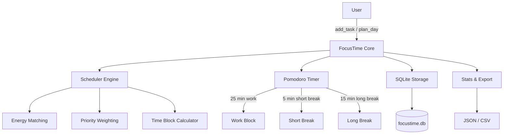

# FocusTime

[](https://github.com/officethree/FocusTime/actions/workflows/ci.yml)
[](https://www.python.org/downloads/)
[](LICENSE)
[](https://pypi.org/project/focustime/)

**Pomodoro + AI Task Scheduling** — A Python library combining the Pomodoro technique with intelligent task scheduling based on priority, estimated duration, and energy levels.

---

## Architecture



## Quickstart

### Installation

```bash
pip install focustime
```

Or from source:

```bash
git clone https://github.com/officethree/FocusTime.git
cd FocusTime
pip install -e ".[dev]"
```

### Basic Usage

```python
from focustime import FocusTime

ft = FocusTime()

# Add tasks with priority (1-5), estimated minutes, and energy level (1-5)
ft.add_task("Write API docs", priority=4, estimated_minutes=60, energy_level=3)
ft.add_task("Code review", priority=5, estimated_minutes=45, energy_level=4)
ft.add_task("Email triage", priority=2, estimated_minutes=20, energy_level=1)

# Plan your day with available hours and energy curve
schedule = ft.plan_day(available_hours=6, energy_curve="morning_peak")

# Start a Pomodoro session
session = ft.start_session(duration_minutes=25)

# Work through blocks
block = ft.get_current_block()
print(f"Working on: {block['task']} ({block['remaining_minutes']} min left)")

# Complete the block and take a break
ft.complete_block()
ft.take_break(minutes=5)

# Check your stats
stats = ft.get_stats()
print(f"Completed: {stats['blocks_completed']} blocks today")

# Get AI-suggested next task
suggestion = ft.suggest_next_task()
print(f"Next up: {suggestion['task']} (score: {suggestion['score']:.1f})")

# Export your schedule
ft.export_schedule(format="json")
```

### Energy Curves

FocusTime supports built-in energy curves to match tasks to your natural rhythm:

| Curve           | Description                              |
|-----------------|------------------------------------------|
| `morning_peak`  | High energy AM, tapering in PM           |
| `afternoon_peak`| Ramp up to peak after lunch              |
| `steady`        | Consistent energy throughout the day     |
| `custom`        | Define your own hourly energy values     |

## Development

```bash
make install    # Install with dev dependencies
make test       # Run test suite
make lint       # Run linter
make format     # Auto-format code
```

## Contributing

See [CONTRIBUTING.md](CONTRIBUTING.md) for guidelines.

---

> Inspired by AI productivity and time management trends

---

**Built by [Officethree Technologies](https://officethree.com) | Made with love and AI**
